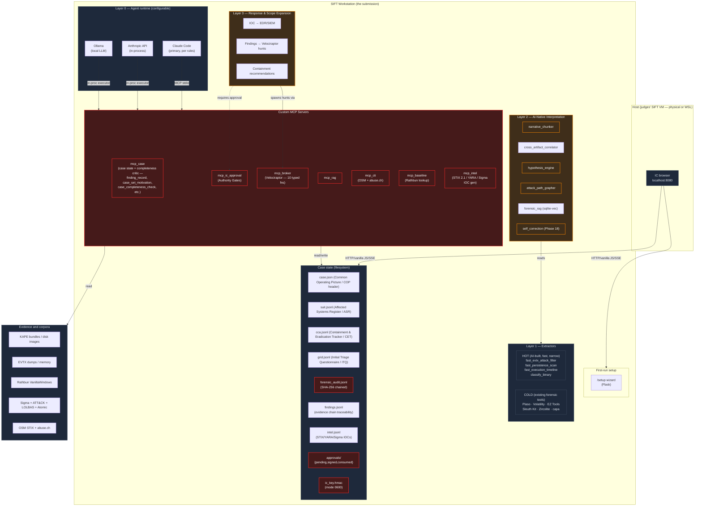

# SIFTics Architecture

Devpost submission item #7 — *Architecture Diagram*.

> **Architectural pattern:** *Custom MCP Server* — Rob T. Lee's #2 approach,
> described in the hackathon rules as *"the most sound architecture in the evaluation."*
> Read-only mounts, typed MCP functions, cryptographically-signed Authority Gates,
> hash-chained audit log — every guardrail enforced **structurally** rather than by
> prompt instruction.

This file is the canonical architecture overview. ASCII diagrams are
embedded inline — the markdown is the source of truth. Section 0
shows the deployment framing (what's in the submission vs. what
exists to demonstrate it); sections 1+ show the internal execution
model in detail.

## 0. Deployment framing — three layers

The README leads with this; here's what it looks like as a diagram.
The vertical bar in the middle is the **MCP integration contract**
— the typed tool surface that makes Layer 1 oblivious to whatever
specific environment is on the right.

```
   ┌──────────────────────────────┐ │ ┌──────────────────────────────┐
   │  Layer 1 — SIFTics agent     │ │ │  Layer 3 — Reference          │
   │  THE SUBMISSION              │ │ │  deployment                   │
   │                              │ │ │  THE PROOF POINT              │
   │   NIMS IC framework          │ │ │                               │
   │   HMAC Authority Gates       │ │ │   sister repo: hunt_lab        │
   │   Hash-chained audit         │ │ │                               │
   │   Safety + Legal Officers    │ │ │   Caldera adversary emulation │
   │   (architectural guardrails) │ │ │   Velociraptor + ELK + AD     │
   │                              │ │ │   3 prebuilt scenarios:       │
   │   Forensic phases 1-20       │ │ │     RansomHub-13-Step         │
   │   HOT / WARM / COLD layers   │ │ │     Identity-Chain-5-Step     │
   │   Phase 18 self-correction   │ │ │     OT-SSH-Brute-WaterPlant   │
   │                              │ │ │                               │
   │   /setup · /gates · /audit   │ │ │   Generates triage bundles    │
   │   Flask UI on :8080          │ │ │   + ground_truth.json keys    │
   │                              │ │ │                               │
   └──────────────┬───────────────┘ │ └───────────────┬───────────────┘
                  │                  │                 │
                  │  ─── mock mode ─►│◄─── real mode ──│
                  │                  │                 │
                  └──────────────────┴─────────────────┘
                                     │
                  ╔══════════════════▼═══════════════════╗
                  ║  Layer 2 — INTEGRATION CONTRACT      ║
                  ║  THE ARCHITECTURE                    ║
                  ║                                      ║
                  ║   Typed MCP tool surface             ║
                  ║   (vendor-agnostic; same signature   ║
                  ║    whether the right-hand side is    ║
                  ║    hunt_lab, a production Velociraptor║
                  ║    cluster, an EDR, or a TIP)        ║
                  ║                                      ║
                  ║   mcp_broker     list_clients,       ║
                  ║                  start_hunt, etc.    ║
                  ║   mcp_containment  isolate_host,     ║
                  ║                    disable_account   ║
                  ║   mcp_intel      publish_iocs        ║
                  ║                                      ║
                  ║   Each carries _MODE = mock | real   ║
                  ║   flipped from /setup's Response-     ║
                  ║   posture radio (Mock — standalone   ║
                  ║   vs. Live — connected); the agent   ║
                  ║   doesn't know which side it's on.   ║
                  ╚══════════════════════════════════════╝
```

**What's in this repository:** Layers 1 and 2. Layer 3 lives at
[github.com/rjonhaas/hunt_lab](https://github.com/rjonhaas/hunt_lab)
and is an *example* of what plugs into the Layer-2 contract —
not a dependency of the submission.

> *NIMS = National Incident Management System; IC = Incident Commander. The full role mapping is in §2c.*

**Mock mode** (Layer 2 default, judges' path): the broker's typed
functions return deterministic stub data (`WKSTN-A14`, `FS-CORP-02`,
`siem-collector-01`). The agent has a complete tool surface and
can be graded end-to-end without any external infrastructure.

**Real mode** (the demo-video path): the broker's typed functions
call out to whatever Velociraptor/EDR/TIP is configured. The same
agent, the same audit chain, the same Authority Gates — now with
hunts actually firing across an enterprise. This is the path that
demonstrates "fighting back at AI-speed."

The mode is selected from `/setup`'s **Response posture** radio
(*Mock — standalone* vs. *Live — connected*). Switching takes
effect on the next agent turn (the save handler patches
`os.environ` in the running Flask process) and writes a
`response_posture_changed` audit event. Anthropic authentication
(Claude.ai subscription vs. pasted API key) is the sibling radio
on the same page and uses the same env-patch + audit pattern
(`runtime_auth_changed`).

---

## 1. Layered execution model



If your renderer does not handle Mermaid, see `docs/architecture.png` (poster
version) or the ASCII fallback below.

## 2. ASCII fallback

```
                    ┌──────────────────────────────────┐
                    │ IC browser → localhost:8080      │
                    └──────────────┬───────────────────┘
                                   │ vanilla JS + SSE
            ╔══════════════════════════════════════════════════════╗
            ║                SIFT Workstation                      ║
            ║                                                      ║
            ║  [Layer 0: Agent runtime]                            ║
            ║   Claude Code  · Anthropic API · Ollama              ║
            ║              │                                        ║
            ║              ▼  MCP stdio / in-process                ║
            ║  ┌──────────────────────────────────────────────┐    ║
            ║  │ Custom MCP Servers (typed; no raw shell)     │ ←─ ║ ARCHITECTURAL
            ║  │  mcp_case  ·  mcp_ic_approval                │    ║ guardrails
            ║  │  mcp_broker (Velociraptor)                   │    ║ (RED)
            ║  │  mcp_rag  ·  mcp_cti  ·  mcp_baseline        │    ║
            ║  │  mcp_intel (STIX/YARA/Sigma IOC gen)         │    ║
            ║  └─────────┬────────────────────────────────────┘    ║
            ║            │                                          ║
            ║   ┌────────▼────────────────────────────────────┐    ║
            ║   │ Layer 3 — Response & Scope Expansion        │ ←─ ║ PROMPT-based
            ║   │   IOC push · hunt deploy · containment      │    ║ orchestration
            ║   └────────▲────────────────────────────────────┘    ║ (YELLOW)
            ║   ┌────────┴────────────────────────────────────┐    ║
            ║   │ Layer 2 — AI-native interpretation          │    ║
            ║   │   narrative_chunker · hypothesis_engine     │    ║
            ║   │   cross_artifact_corr · attack_path_grapher │    ║
            ║   │   forensic_rag · self_correction (Phase 18) │    ║
            ║   └────────▲────────────────────────────────────┘    ║
            ║   ┌────────┴────────────────────────────────────┐    ║
            ║   │ Layer 1 — Extractors                        │    ║
            ║   │   HOT  AI-built, narrow, fast (<30s)        │    ║
            ║   │   COLD existing forensic tools (defensible) │    ║
            ║   └─────────────────────────────────────────────┘    ║
            ║                                                      ║
            ║  Case state (filesystem)                             ║
            ║   case.json · suit.jsonl · cca.jsonl · grid.jsonl    ║
            ║   findings.jsonl (evidence chain) ·                  ║
            ║   intel.jsonl (STIX/YARA/Sigma IOCs)                 ║
            ║   approvals/ (pending,signed,consumed)               ║ ARCHITECTURAL:
            ║   forensic_audit.jsonl  (SHA-256 chained)            ║ ic_key.hmac
            ║   ic_key.hmac (mode 0600, IC-owned)                  ║ (RED)
            ╚══════════════════════════════════════════════════════╝
                                   │  reads / writes
              ┌────────────────────┼───────────────────────┐
              ▼                    ▼                       ▼
      ┌───────────────┐  ┌──────────────────┐  ┌──────────────────┐
      │ Evidence:     │  │ Corpora:         │  │ Hunt_lab VMs:    │
      │  KAPE bundles │  │  Rathbun baseline│  │  (victim network)│
      │  EVTX, memory │  │  Sigma/ATT&CK    │  │  evidence source │
      │  disk images  │  │  LOLBAS, Atomic  │  │  not part of     │
      │               │  │  OSM, abuse.ch   │  │  submission      │
      └───────────────┘  └──────────────────┘  └──────────────────┘
```

## 2b. Command Staff under a single-agent loop

SIFTics models NIMS Incident Command System (ICS) doctrine: an **Incident
Commander** (the human analyst) sits at the top of the structure, and a
single **Investigation Section Chief** (the Claude Code agent) runs the
tactical investigation. v1.1 adds two NIMS Command Staff roles — **Safety
Officer** and **Legal Officer** — that get consulted before any Authority
Gate is surfaced to the IC.

**These roles are not separate agents.** They are personas activated by
loading the corresponding skill file (`skills/safety-officer.md`,
`skills/legal-officer.md`) as a sub-prompt within the same Claude session
that runs the Investigation Section Chief. The persona produces a
structured JSON assessment matching the skill's schema and submits it via
a typed MCP tool (`consult_safety_officer`, `consult_legal_officer`),
which validates schema and writes the assessment to the hash-chained
audit log.

### Why personas, not separate agents

The persona pattern is a pragmatic v1 choice. The trade-offs:

| Multi-agent pattern would give us | Persona pattern gives us instead |
|---|---|
| Fresh-eyes review (no IC framing bias) | Same context — but a structured output schema (5 dimensions × score + rationale) forces the role to fill specific fields rather than nod along |
| Separate tool surface per role | A bounded sub-prompt and a single consult MCP tool per role — the persona can't reach for arbitrary tools mid-consultation |
| Doctrinal purity | A documented compromise. We call this *NIMS-doctrine-aligned single-agent Command Staff*, not "multiple agents" |
| Marshaling cost (tokens to copy case state) | Zero context marshaling — the persona inherits the live conversation |
| Audit fragmentation across agents | One audit chain, ``actor`` field per row records the role that wrote it |

The architectural property of the consults is enforced at the MCP-tool
schema layer: `consult_safety_officer` will not accept any verdict other
than `hard_stop` when the `personnel_safety` dimension is scored
`high`/`critical`. That makes the personnel-safety rule survive even if
the persona prompt is bypassed. A misaligned model attempting to write a
`clear` assessment for an OT/ICS host will be rejected by the tool
before the audit event is written. (See `docs/constraint_implementation.md`
G16, G17.)

### Why not Finance and Public Information Officer (in v1.1)

NIMS doctrine also includes Finance / Administration Section Chief and
Public Information Officer. v1.1 deliberately ships Safety + Legal first.
Finance, PIO, and Liaison are sketched in §2c–§2f below — they don't
ship as code in this submission, but they're documented so the
architectural completeness story holds.

---

## 2c. Mapping to NIMS Incident Command System

The canonical NIMS ICS organizational chart (FEMA-published) has one
position at the top — **Incident Commander** — with two distinct
support structures hanging off it:

- **Command Staff** (Public Information Officer, Safety Officer,
  Liaison Officer) — report directly to the IC, *outside* the tactical
  chain of command. Their authority is to advise + flag, not to
  execute. Safety Officer specifically has the *standing to stop work*.
- **General Staff** — four Section Chiefs who do the tactical work:
  **Operations Section** (the response itself), **Planning Section**
  (next-cycle thinking, situation awareness, documentation),
  **Logistics Section** (resources, infrastructure, comms), and
  **Finance/Administration Section** (cost tracking, procurement,
  comp/claims).

SIFTics does not need to be lock-step with NIMS — but it has been a
proven command structure for emergency response since the 1970s and
applies cleanly to a machine-paced incident response, so we adopt it
as the framework and document where we deviate or collapse roles.

The full mapping:

| Role | NIMS canonical | SIFTics today | Status / where it lives |
|---|---|---|---|
| Incident Commander | ✓ | The human analyst | Owns strategic decisions; final sign-off on every Authority Gate |
| Operations Section Chief | ✓ | (collapsed into ISC) | The agent's tactical-execution role: which phase to run, which IOCs to chase, what to record. `skills/investigation-section-chief.md`. |
| Planning Section Chief | ✓ | (collapsed into ISC) | The agent's next-cycle-thinking role: hypothesis engine (`skills/hypothesis-engine.md`), Phase 18 anomaly check (`phases/anomaly_check.py`), situation awareness in the COP. Two NIMS roles handled by one agent persona, deliberately. |
| Logistics Section Chief | ✓ | not implemented | Sketched in §2d for a deployed-for-real scenario. Out of scope for an offline forensic walkthrough. |
| Finance/Admin Section Chief | ✓ | partial (`siftics/cost_tracker.py`) | Cost-tracker + per-case budget circuit breaker exists; persona that wraps it sketched in §2e. |
| Safety Officer | ✓ | ✓ persona + MCP tool | `skills/safety-officer.md` + `mcp_case.consult_safety_officer`. G16 architectural hard-stop. |
| Public Information Officer | ✓ | not implemented | Sketched in §2f. The PIO → Legal → IC workflow is the key piece. |
| Liaison Officer | ✓ | partially folded into Legal | The third_party_nda_scope dimension on `consult_legal_officer` belongs to Liaison in proper NIMS. Cleaner split sketched in §2g. |
| **Legal Officer** | not standard | ✓ persona + MCP tool | `skills/legal-officer.md` + `mcp_case.consult_legal_officer`. **Cyber-IR adaptation, not canonical NIMS.** Documented honestly. |

The deviations we make and why:

- **Combining Operations + Planning into one Section Chief**: a single
  AI agent runs one investigation; in canonical NIMS those are two
  human Section Chiefs because the cognitive load of doing-the-work-now
  and thinking-about-the-next-shift in parallel is too much for one
  person. Not a problem for an agent that doesn't get tired. We may
  split these if SIFTics ever grows multi-shift handoff support.
- **Adding Legal Officer as Command Staff** is non-canonical. Type-1
  cyber-IR teams routinely add Legal as a 4th Command Staff position
  because breach-notification clocks and privilege scope dominate the
  decision space in a way that fire / flood / hurricane responses
  don't. We document this as a cyber adaptation, not a NIMS purity
  claim.
- **Liaison Officer**'s third-party-NDA / vendor-coordination function
  is currently folded into Legal Officer's `third_party_nda_scope`
  dimension. A future v1.2 could split them — Liaison handles the
  *coordination* (NDA scope, MSSP engagement, ISAC sharing) while
  Legal handles the *advisability* (privilege, admissibility,
  regulator triggers). For v1.1, the merged role is honest about the
  collapse.

---

## 2d. Logistics Section — what a real-deployment architecture would look like

NIMS Logistics owns *the resources the responders need to do their job*.
For a digital incident response that's deployed at an organization (not
running as a hackathon-bench tool against forensic images), the
Logistics Section would be responsible for the operational infrastructure
that SIFTics itself runs on. **Nothing in this section is implemented
in v1.1.** It's documented so the architectural completeness story
covers a realistic deployment, not just the offline forensic walkthrough.

### What Logistics would cover

| Logistics responsibility | What it looks like for SIFTics in real deployment |
|---|---|
| **Identity and RBAC** | Provision identities for every responder (IC, analyst, junior analyst, observer). Just-in-time access to the case directory, mediated by an IdP (Okta / Entra). Read-only observer mode for legal-counsel viewers. SIFTics's MCP gateway authorizes per-role, refusing case-mutation calls for read-only roles. |
| **Remote-access tunneling** | The IR team is not always on the corporate LAN — especially mid-breach, where they may deliberately be working off the corp network. **Cloudflare Tunnels** (or Tailscale) provide an authenticated reverse tunnel from the SIFTics host to a token-gated public endpoint each authorized responder can reach. No port exposure on the IR host; auth and audit happen at the tunnel boundary. |
| **Evidence storage with chain-of-custody** | Write-once-read-many evidence buckets (AWS S3 Object Lock, or equivalent). Every artifact ingested into SIFTics writes a paired immutable copy with hash + ingest_audit_id. Logistics owns the policy (retention period, legal-hold flag, destruction process). |
| **Sandbox compute** | On-demand spin-up of analysis VMs for malware detonation, memory analysis, or anything that shouldn't touch the analyst workstation. Logistics provisions and destroys them per case; SIFTics's `mcp_broker` orchestrates the actual workload. |
| **Secrets management** | The IC's HMAC key today is mode-0600 on the analyst's disk. In a deployed-for-real architecture, that key lives in an HSM or KMS (AWS KMS, HashiCorp Vault Transit). IC signing happens via the KMS API rather than a local file. Migration path to Ed25519 (the v2 plan) integrates here. |
| **Toolchain logistics** | Keeping SIFTics, mac_apt, Volatility, Plaso, EZ Tools, etc. up to date and *pinned*. The SBOM-hash work already in v1.1 (G15) is the foundation — Logistics would own the pipeline that rebuilds and re-pins the toolchain on a known cadence, with sign-off by Safety before deployment. |
| **Comms infrastructure** | A war-room channel that doesn't live on the corporate IT stack during a breach (because the attacker may be reading corporate Slack). Out-of-band Signal / Matrix / dedicated comms. Logistics owns provisioning and access list. |
| **Status board / dashboard** | Multi-IC operational picture for major incidents — multiple cases, cross-case IOC reuse, executive-rollup view. SIFTics's single-case dashboard would be one tile of a larger Logistics-provisioned board. |
| **Backup and disaster recovery** | Audit chains, findings, IC keys, sboms — all replicated across regions on a Logistics-defined schedule. |

### Why this isn't built in v1.1

- The hackathon evaluates SIFTics as an offline forensic tool running
  against pre-collected evidence (KAPE bundles, disk images). None of
  the Logistics responsibilities above are exercised by that workflow.
- A real Logistics implementation is multiple engineer-months and
  involves cloud-provider opinion (AWS-flavored vs. self-hosted vs.
  GCP), which is out of scope for a hackathon submission.
- The architectural shape is clear enough that adding it is a
  configuration-and-integration project, not a "rethink the doctrine"
  project. The Custom MCP Server pattern accommodates it cleanly:
  add `mcp_logistics` with typed functions (`provision_sandbox`,
  `provision_responder_access`, `lock_evidence`, `rotate_ic_key`),
  each going through the same Authority Gate machinery as
  `execute_hunt_package`.

### The architectural property we preserve

Even without Logistics implemented, **the gate machinery is already
the right enforcement point** for these actions. Provisioning a
sandbox VM, rotating an IC key, exposing a Cloudflare tunnel — all
of these are state-changing actions that would require IC sign-off
in a real deployment. SIFTics's `mcp_ic_approval` + Safety/Legal
consult pattern means a future `mcp_logistics` server gets the same
guarantees: typed `approval` parameter, schema-enforced consults,
hash-chained audit. No new architectural work; just new tools.

---

## 2e. Finance / Admin Section — present, partial

NIMS Finance/Admin covers Time Unit, Cost Unit, Procurement Unit, and
Compensation Claims Unit. SIFTics implements the Cost Unit's job
today (`siftics/cost_tracker.py`) but does not yet have a Finance
Officer persona that wraps it the way Safety and Legal wrap their
domains.

### What's implemented today

- `siftics/cost_tracker.py` — per-call LLM cost tracking, per-case
  cumulative spend, configurable per-case budget circuit breaker.
- G9 architectural guardrail: `check_budget_or_raise()` refuses LLM
  calls once the per-case spend hits the configured ceiling.

### What a Finance Officer persona would add (sketch, not built)

A `skills/finance-officer.md` mirroring Safety/Legal, with five
dimensions:

| Dimension | What it scores |
|---|---|
| `current_spend` | Where the case is vs. budget (low / medium / high / critical) |
| `projection_window` | What the remaining ITQ + open hypotheses + planned hunts would cost (medium-high if projection blows budget) |
| `vendor_engagement` | When the case proposes engaging an outside IR retainer, malware lab, or specialised analyst (cost, scope, NDA) |
| `recovery_cost_class` | Class of recovery work the findings imply (rebuild N hosts, license recovery, regulatory fines) — feeds the after-action report |
| `breach_insurance_scope` | Whether the proposed actions are within the policy's covered scope (some carriers exclude certain forensic vendors or pre-authorise others) |

`consult_finance_officer` would be called automatically when:
- A gate's projected cost exceeds 50% of the remaining budget.
- The agent proposes a vendor-engagement action (e.g. requesting
  outside malware analysis).
- The IC opens a "what would containment cost" hypothesis.

Architectural hard-stop: budget circuit breaker (G9) already exists.
The Finance Officer persona is *informational*; it doesn't add a new
architectural constraint, it surfaces signals to the IC before the
budget gate fires.

Staged for v1.2 — not load-bearing for the Find Evil! demo case.

---

## 2f. Public Information Officer + Legal compliance-document workflow

The PIO is Command Staff in canonical NIMS — its job is external
communication. For cyber-IR, that's customer notifications, regulator
filings, press releases, executive briefings, and the internal
"holding statement" that goes out before facts are confirmed.

**Critical workflow detail**: PIO **drafts** statements; **Legal
reviews them for compliance and privilege**; **IC signs off** before
publication. This is a three-step Authority Gate, not a single
person's decision.

### What the PIO persona produces (now built — `skills/public-information-officer.md` + `pio_draft_statement` MCP tool)

`skills/public-information-officer.md` owns these
deliverables — *drafts only*, none auto-published:

| Deliverable | When | Goes to |
|---|---|---|
| **Holding statement** | First public awareness; facts not yet confirmed | Customer comms team, support desk |
| **Customer notification** | Confirmed unauthorised access affecting customer data | Affected customers, support desk |
| **Press release** | Major incident, public attention building | Press contacts, comms team |
| **Executive briefing** | Internal — board, C-suite, regional leadership | Internal exec team |
| **Customer-facing FAQ** | Follow-up after notification | Support desk, website |

Each draft is written by the PIO persona using:
- Facts confirmed in the audit chain (only).
- Templates Legal maintains (see below).
- No speculation — every claim either traces to an audit row or is
  explicitly labelled as "as of now, unconfirmed."

### Legal's compliance-document templates

Legal Officer owns canonical templates for the regulatory artifacts
SIFTics may need to help draft. SIFTics does **not** author these —
it provides the template skeleton with placeholders, the audit-chain
facts filled in, and outside counsel reviews and signs:

| Template | Triggered by | Owner of final | Where the template lives |
|---|---|---|---|
| **SEC Form 8-K Item 1.05** — material cybersecurity incident | US public company, board determines materiality | Outside counsel + SEC counsel | `legal_templates/sec_8k_item_1_05.md` (planned) |
| **GDPR Art. 33 notification** to supervisory authority | 72h from awareness of personal-data breach | Outside counsel + DPO | `legal_templates/gdpr_art33.md` (planned) |
| **GDPR Art. 34 notification** to affected individuals | When high risk to data subjects | Outside counsel + DPO | `legal_templates/gdpr_art34.md` (planned) |
| **HIPAA Breach Notification Rule letter** | 60d from discovery to affected individuals | Outside counsel + Privacy Officer | `legal_templates/hipaa_breach.md` (planned) |
| **State breach notification** (US, ~50 variants) | Per-state law | Outside counsel | `legal_templates/state_breach/<state>.md` (planned) |
| **PCI DSS forensic investigation notice** | CHD compromise | Acquirer + card brands | `legal_templates/pci_dss_notice.md` (planned) |

The Legal Officer persona's role in v1.2+ would be:
1. Identify which templates apply to the case (driven by the case's
   `data_classes_touched` finding tags + the regulatory regime).
2. Fill in the placeholders with audit-confirmed facts only.
3. Hand the resulting draft to outside counsel for review (audit
   event: `legal_draft_handed_to_counsel`).
4. Surface counsel's edits back into the case.

This is *workflow*, not *legal advice*. SIFTics is still not
substituting for outside counsel — it's automating the boring
secretarial work of populating templates from the audit chain.

### Why the PIO ↔ Legal ↔ IC chain matters

A misaligned model that drafts a press release and pushes it directly
to a public channel would be a catastrophic failure mode. The
architectural answer in SIFTics is the same as for every other
high-blast-radius action: there is no `publish_press_release()`
function on the MCP surface. The PIO persona writes a `draft_brief`
audit event. The Legal Officer reviews it via a `legal_review_brief`
audit event. The IC signs a `publish_brief` Authority Gate with
HMAC. Only after all three exist does anything leave the case
directory.

Same pattern as `execute_hunt_package` and `publish_intel`. Different
artifact, same architecture.

Staged for v1.2 — out of scope for the offline forensic walkthrough,
but the architectural slot is reserved.

---

## 2g. Liaison Officer — folded into Legal in v1.1, split in v1.2

In canonical NIMS, Liaison Officer is Command Staff alongside Safety
and PIO. Their job is *coordination with external parties* — other
agencies, vendors, jurisdictions.

For cyber IR that translates to:

- Coordinating with the **MSSP** the org has on retainer.
- Engaging an **outside IR retainer** (Mandiant, Crowdstrike Services,
  Unit 42, etc.) when scope or specialisation requires it.
- Sharing IOCs with **ISACs** (FS-ISAC, H-ISAC, etc.) and trusted
  peer organisations.
- Coordinating with **law enforcement** (FBI, CISA, NCA, BfV) when the
  case warrants criminal-investigation engagement.
- Liaison with **regulators** outside of breach-notification (e.g.
  FCA, BaFin during ongoing examinations).

SIFTics v1.1 folds these into the Legal Officer's
`third_party_nda_scope` dimension. That's an honest collapse — Legal
and Liaison both touch external parties, and for a single-IC offline
analysis case the distinction is academic.

A v1.2 split would introduce:

- `skills/liaison-officer.md` with the dimensions above
- `mcp_case.consult_liaison_officer` mirroring Safety/Legal
- A G18 architectural guardrail: actions that engage external
  parties (vendor scoping, ISAC pushes, LE referrals) require a
  recent Liaison consult.

Until then, the merged role is documented honestly here so judges and
operators know the collapse is deliberate, not an oversight.

---

## 3. Trust boundaries — architectural vs prompt-based

The hackathon's criterion #4 (*Constraint Implementation*) explicitly asks judges
to distinguish architectural from prompt-based guardrails. The table below maps
every guardrail in SIFTics. **Architectural guardrails are enforced by the
absence of capability — code that can't bypass them doesn't exist on the MCP
surface.**

| # | Guardrail | Type | Mechanism | Tested by |
|---|---|---|---|---|
| G1 | Action functions require typed `ICApproval` | **architectural** | Function signature; Python rejects calls without it before body runs | `test_t8b_missing_approval_rejected` |
| G2 | HMAC signature verification | **architectural** | `hmac.compare_digest` of canonical payload | `test_t8a`, `test_t8e_tampered_approval_rejected` |
| G3 | Single-use approval | **architectural** | `O_EXCL` atomic create of `consumed/<id>.json` | `test_t5_ic_approval_single_use` |
| G4 | Wrong-gate rejection | **architectural** | `require_approval(expected_gate=…)` mismatch raise | `test_t6_ic_approval_wrong_gate_rejected` |
| G5 | Agent-context drift detection | **architectural** | Re-hash COP-changing events; compare to anchor | `test_t8d_agent_context_drift_rejected` |
| G6 | Approval TTL expiry | **architectural** | `calendar.timegm` UTC age vs `meta.ttl_seconds` | `test_t8c_expired_approval_rejected` |
| G7 | IC key not on agent surface | **architectural** | `ic_key.hmac` mode 0600 / different uid; never read by MCP server in production mode | not directly testable; v2 Ed25519 split makes it provable |
| G8 | Audit chain tamper detection | **architectural** | SHA-256 chained `line_hash` over canonical event JSON | `test_t4_audit_chain_detects_tampering` |
| G9 | Budget circuit breaker | **architectural** | `check_budget_or_raise()` raises `BudgetExceeded` before LLM call | `test_t7_budget_circuit_breaker` |
| G10 | Custom artifact namespace guard (Velociraptor uploads) | **architectural** | mcp_broker rejects names not starting with `SIFTICS_` or `Custom.` | `test_t2_velociraptor_artifact_namespace_guard` |
| G11 | Read-only evidence mounts | **architectural** | `verify_readonly_mounts.sh` pre-flight; bind-mount with `ro` flag | `test_t1_readonly_mount_check_returns_function` (policy assertion only in v1) |
| G12 | No `execute_shell()` / `eval()` on MCP surface | **architectural** | Function absence; surface review | mcp_case enumerates 14 typed fns |
| G13 | Prompt-injection sanitiser at MCP boundary | **architectural** | Regex-based scrub before output reaches agent | `test_t3_prompt_injection_sanitiser_strips_known_patterns` |
| P1 | NIMS ICS roles (ISC vs IC) | prompt-based | Skill file `investigation-section-chief.md` | not measured |
| P2 | Phase-script ordering hints | prompt-based | `triage-methodology` skill + Daedalus run-plan manifest | not measured |
| P3 | Hypothesis-engine usage guidance | prompt-based | Skill file `hypothesis-engine.md` | not measured |
| P4 | Briefing cadence guidance | prompt-based | Skill file methodology hints | not measured |
| P5 | Windows artifact triage guidance | prompt-based | Skill file `windows-artifacts.md` | not measured |
| P6 | Linux server artifact triage guidance | prompt-based | Skill file `linux-server-artifacts.md` | not measured |
| P7 | Malware triage procedure | prompt-based | Skill file `malware-triage.md` | not measured |
| P8 | Timeline reconstruction approach | prompt-based | Skill file `timeline-reconstruction.md` | not measured |
| P9 | Anti-forensics detection guidance | prompt-based | Skill file `anti-forensics-detection.md` | not measured |
| P10 | Reporting conventions | prompt-based | Skill file `reporting-conventions.md` | not measured |
| P11 | macOS artifact triage guidance (mac_apt, Unified Log, APFS, persistence) | prompt-based | Skill file `macos-artifacts.md` | not measured |
| P12 | IoT/OT artifact guidance (firmware blobs, industrial PCAPs, SCADA DBs) | prompt-based | Skill file `iot-ot-artifacts.md` | not measured |
| P13 | Daedalus tool-finder/implementer workflow (6-step; IC approval required before running unfamiliar tools) | prompt-based | Skill file `daedalus.md` | not measured |

**Headline:** 13 architectural guardrails — 12 measurable, all 12 pass — vs.
13 prompt-based. Compare to a Direct Agent Extension (Rob's #1 approach) which
typically has 1-2 architectural and the rest prompt-based.

## 4. Data flow — a single investigation

```
1.  IC opens browser at localhost:8080
       └─> Flask renders dashboard reading case state files

2.  IC starts agent: `claude` (Claude Code) or via /chat in browser
       └─> Agent invokes mcp_case.itq_unanswered() — gets the questionnaire

3.  Agent runs Phase scripts (HOT path: fast_evtx_attack_filter, etc.)
       └─> Extracts evidence, writes findings, appends asr_appended events

4.  Layer 2 interpretation runs on extractor output
       └─> narrative_chunker, classify_binary, cross_artifact_correlator
       └─> Calls mcp_baseline + mcp_rag + mcp_cti for enrichment
       └─> Each call emits a typed audit event:
             mcp_rag     → rag_lookup     (source_type: "ai_enrichment")
             mcp_baseline → baseline_lookup (source_type: "deterministic")
             mcp_cti     → cti_lookup     (source_type: "deterministic")

5.  Agent surfaces an Authority Gate proposal (one of four gates:
    execute_hunt_package · containment_action · evidence_acquisition · publish_intel)
       └─> ic_request_approval(gate="execute_hunt_package", ...)
       └─> Pending request written; ic_request_approval audit event

6.  IC reviews in /gates UI, types passphrase, clicks Approve
       └─> Flask /gates/sign derives HMAC key, signs payload
       └─> signed/<request_id>.json written; ic_approval_signed audit event

7.  Agent polls ic_check_approval; sees decision=approved
       └─> Calls execute_hunt_package(package, approval)
       └─> mcp_ic_approval verifies signature, gate, context, double-spend
       └─> Hands off to mcp_broker which fires the Velociraptor hunt
       └─> action_executed audit event with hunt_id

8.  Hunt results return; new ASR rows appended for any hit hosts
       └─> Self-correction loop (Phase 18) runs cross-artifact anomaly scan

9.  Pre-close completeness critic
       └─> Agent calls mcp_case.case_completeness_check()
       └─> siftics/completeness_rules.py runs 7 typed rules against
           the case state; returns gaps ordered HIGH → MEDIUM → LOW
       └─> Agent addresses every HIGH gap before motivation lock-in,
           then calls case_set_motivation(text) to lock the
           attacker-motive narrative into the case header

10. /report renders Executive Summary card + Affected Systems Register
       └─> Two-paragraph narrative derived from header + ASR + briefings + ITQ
       └─> Same prose prepended to Markdown export at /report/download
       └─> Dashboard auto-refreshes via SSE
       └─> audit_verify.sh confirms chain integrity end-to-end
```

## 5. Threat model summary

| Adversary | Capability | Defended by |
|---|---|---|
| Misaligned agent (hallucination / jailbreak) | Calls any MCP tool | G1, G4, G7, G10, G12 |
| Prompt injection via evidence text | Shapes agent reasoning | G13 + signed approvals (G1–G7) bound to context |
| Replay attack | Re-use captured approval | G3 single-use, G6 TTL, G5 drift |
| Tampering with audit log | Hide unapproved actions | G8 chain verify |
| Forging an approval | Skip IC review | G2 HMAC; G7 key not on MCP surface |
| Budget runaway | Exhaust API credits | G9 circuit breaker |
| Spoliation of original evidence | Mutate KAPE bundle / disk image | G11 read-only mounts + G12 surface review |
| AI hallucination in enrichment claims | Agent asserts unsupported facts | RAG grounding (every enrichment backed by retrieved record); `source_type` field in audit log distinguishes `ai_enrichment` from `deterministic` lookups so analysts know what to verify (see [`accuracy_report.md §3`](accuracy_report.md)) |

## 6. What's deliberately *not* defended in v1

Documented honestly here so judges and operators know what to wear:

- A compromised IC host that exposes the IC's HMAC key — out of scope (assume
  the IC's signing workstation is trusted).
- Side-channel coercion of the IC into signing a bad action — the audit chain
  at least records the signed approval for post-incident attribution.
- Active attacks against the SIFT VM during an investigation — orthogonal to
  the constraint architecture; SIFT VM hardening is its own discipline.
- Resource exhaustion via excessive `mcp_baseline` lookups — could DOS the
  agent loop; future work.

## 7. Cross-references

- Bypass test source: [`tests/test_constraints.py`](../tests/test_constraints.py)
- IC approval implementation: [`siftics/ic_approval.py`](../siftics/ic_approval.py)
- Audit chain: [`siftics/audit.py`](../siftics/audit.py)
- mcp_case server: [`mcp_case/server.py`](../mcp_case/server.py) — writes `findings.jsonl` via `finding_record()`; exposes `case_set_motivation()` + `case_completeness_check()`
- Completeness critic rules: [`siftics/completeness_rules.py`](../siftics/completeness_rules.py) — 7 pure-Python rules over a `CaseState` dataclass, called by `case_completeness_check()`
- mcp_intel server: [`mcp_intel/server.py`](../mcp_intel/server.py) — generates STIX 2.1 / YARA / Sigma from typed IOCs; writes `intel.jsonl`
- mcp_ic_approval server: [`mcp_ic_approval/server.py`](../mcp_ic_approval/server.py)
- Agent runtime backends: [`siftics/agent_runtime.py`](../siftics/agent_runtime.py)
- Cost tracker / budget breaker: [`siftics/cost_tracker.py`](../siftics/cost_tracker.py)
- Constraint implementation matrix: [`docs/constraint_implementation.md`](constraint_implementation.md)
