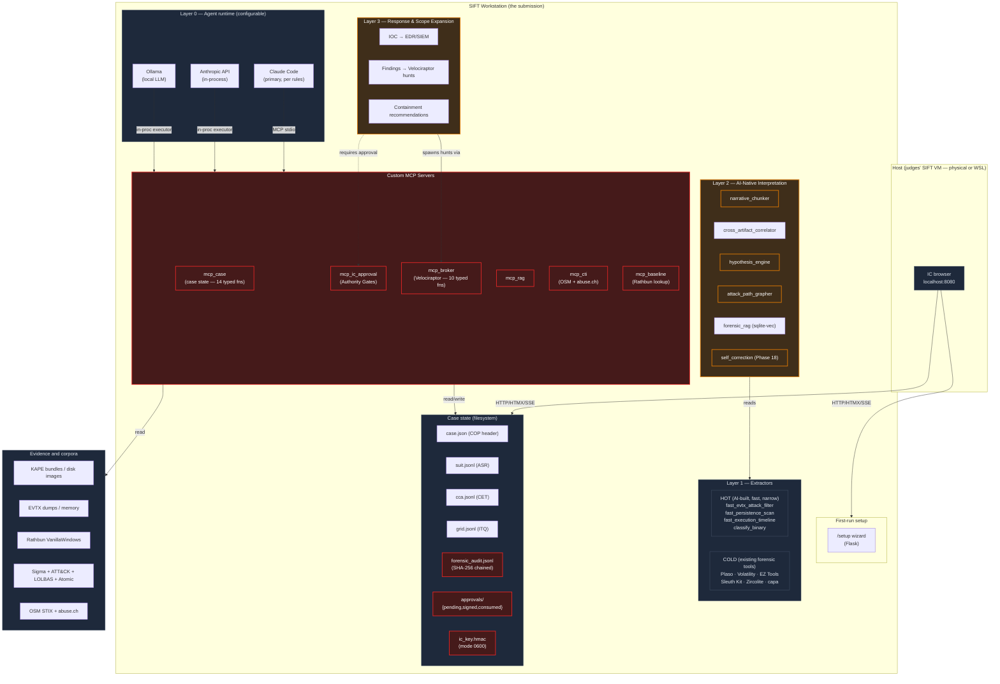

# SIFTics Architecture

Devpost submission item #7 — *Architecture Diagram*.

> **Architectural pattern:** *Custom MCP Server* — Rob T. Lee's #2 approach,
> described in the hackathon rules as *"the most sound architecture in the evaluation."*
> Read-only mounts, typed MCP functions, cryptographically-signed Authority Gates,
> hash-chained audit log — every guardrail enforced **structurally** rather than by
> prompt instruction.

This file is the canonical architecture overview. The companion image
`docs/architecture.png` is the colour-coded poster (red = architectural,
yellow = prompt-based); this markdown is the source of truth.

## 1. Layered execution model



If your renderer does not handle Mermaid, see `docs/architecture.png` (poster
version) or the ASCII fallback below.

## 2. ASCII fallback

```
                    ┌──────────────────────────────────┐
                    │ IC browser → localhost:8080      │
                    └──────────────┬───────────────────┘
                                   │ HTMX + SSE
            ╔══════════════════════════════════════════════════════╗
            ║                SIFT Workstation                      ║
            ║                                                      ║
            ║  [Layer 0: Agent runtime]                            ║
            ║   Claude Code  · Anthropic API · Ollama              ║
            ║              │                                        ║
            ║              ▼  MCP stdio / in-process                ║
            ║  ┌──────────────────────────────────────────────┐    ║
            ║  │ Custom MCP Servers (typed; no raw shell)     │ ←─ ║ ARCHITECTURAL
            ║  │  mcp_case  ·  mcp_ic_approval                │    ║ guardrails
            ║  │  mcp_broker (Velociraptor)                   │    ║ (RED)
            ║  │  mcp_rag  ·  mcp_cti  ·  mcp_baseline        │    ║
            ║  └─────────┬────────────────────────────────────┘    ║
            ║            │                                          ║
            ║   ┌────────▼────────────────────────────────────┐    ║
            ║   │ Layer 3 — Response & Scope Expansion        │ ←─ ║ PROMPT-based
            ║   │   IOC push · hunt deploy · containment      │    ║ orchestration
            ║   └────────▲────────────────────────────────────┘    ║ (YELLOW)
            ║   ┌────────┴────────────────────────────────────┐    ║
            ║   │ Layer 2 — AI-native interpretation          │    ║
            ║   │   narrative_chunker · hypothesis_engine     │    ║
            ║   │   cross_artifact_corr · attack_path_grapher │    ║
            ║   │   forensic_rag · self_correction (Phase 18) │    ║
            ║   └────────▲────────────────────────────────────┘    ║
            ║   ┌────────┴────────────────────────────────────┐    ║
            ║   │ Layer 1 — Extractors                        │    ║
            ║   │   HOT  AI-built, narrow, fast (<30s)        │    ║
            ║   │   COLD existing forensic tools (defensible) │    ║
            ║   └─────────────────────────────────────────────┘    ║
            ║                                                      ║
            ║  Case state (filesystem)                             ║
            ║   case.json · suit.jsonl · cca.jsonl · grid.jsonl    ║
            ║   approvals/ (pending,signed,consumed)               ║ ARCHITECTURAL:
            ║   forensic_audit.jsonl  (SHA-256 chained)            ║ ic_key.hmac
            ║   ic_key.hmac (mode 0600, IC-owned)                  ║ (RED)
            ╚══════════════════════════════════════════════════════╝
                                   │  reads / writes
              ┌────────────────────┼───────────────────────┐
              ▼                    ▼                       ▼
      ┌───────────────┐  ┌──────────────────┐  ┌──────────────────┐
      │ Evidence:     │  │ Corpora:         │  │ Hunt_lab VMs:    │
      │  KAPE bundles │  │  Rathbun baseline│  │  (victim network)│
      │  EVTX, memory │  │  Sigma/ATT&CK    │  │  evidence source │
      │  disk images  │  │  LOLBAS, Atomic  │  │  not part of     │
      │               │  │  OSM, abuse.ch   │  │  submission      │
      └───────────────┘  └──────────────────┘  └──────────────────┘
```

## 3. Trust boundaries — architectural vs prompt-based

The hackathon's criterion #4 (*Constraint Implementation*) explicitly asks judges
to distinguish architectural from prompt-based guardrails. The table below maps
every guardrail in SIFTics. **Architectural guardrails are enforced by the
absence of capability — code that can't bypass them doesn't exist on the MCP
surface.**

| # | Guardrail | Type | Mechanism | Tested by |
|---|---|---|---|---|
| G1 | Action functions require typed `ICApproval` | **architectural** | Function signature; Python rejects calls without it before body runs | `test_t8b_missing_approval_rejected` |
| G2 | HMAC signature verification | **architectural** | `hmac.compare_digest` of canonical payload | `test_t8a`, `test_t8e_tampered_approval_rejected` |
| G3 | Single-use approval | **architectural** | `O_EXCL` atomic create of `consumed/<id>.json` | `test_t5_ic_approval_single_use` |
| G4 | Wrong-gate rejection | **architectural** | `require_approval(expected_gate=…)` mismatch raise | `test_t6_ic_approval_wrong_gate_rejected` |
| G5 | Agent-context drift detection | **architectural** | Re-hash COP-changing events; compare to anchor | `test_t8d_agent_context_drift_rejected` |
| G6 | Approval TTL expiry | **architectural** | `calendar.timegm` UTC age vs `meta.ttl_seconds` | `test_t8c_expired_approval_rejected` |
| G7 | IC key not on agent surface | **architectural** | `ic_key.hmac` mode 0600 / different uid; never read by MCP server in production mode | not directly testable; v2 Ed25519 split makes it provable |
| G8 | Audit chain tamper detection | **architectural** | SHA-256 chained `line_hash` over canonical event JSON | `test_t4_audit_chain_detects_tampering` |
| G9 | Budget circuit breaker | **architectural** | `check_budget_or_raise()` raises `BudgetExceeded` before LLM call | `test_t7_budget_circuit_breaker` |
| G10 | Custom artifact namespace guard (Velociraptor uploads) | **architectural** | mcp_broker rejects names not starting with `SIFTICS_` or `Custom.` | `test_t2_velociraptor_artifact_namespace_guard` |
| G11 | Read-only evidence mounts | **architectural** | `verify_readonly_mounts.sh` pre-flight; bind-mount with `ro` flag | `test_t1_readonly_mount_check_returns_function` (policy assertion only in v1) |
| G12 | No `execute_shell()` / `eval()` on MCP surface | **architectural** | Function absence; surface review | mcp_case enumerates 14 typed fns |
| G13 | Prompt-injection sanitiser at MCP boundary | **architectural** | Regex-based scrub before output reaches agent | `test_t3_prompt_injection_sanitiser_strips_known_patterns` |
| P1 | NIMS ICS roles (ISC vs IC) | prompt-based | Skill file `investigation-section-chief.md` | not measured |
| P2 | Phase-script ordering hints | prompt-based | `triage-methodology` skill + Daedalus run-plan manifest | not measured |
| P3 | Hypothesis-engine usage guidance | prompt-based | Skill file `hypothesis-engine.md` | not measured |
| P4 | Briefing cadence guidance | prompt-based | Skill file methodology hints | not measured |

**Headline:** 13 architectural guardrails — 12 measurable, all 12 pass — vs.
4 prompt-based. Compare to a Direct Agent Extension (Rob's #1 approach) which
typically has 1-2 architectural and the rest prompt-based.

## 4. Data flow — a single investigation

```
1.  IC opens browser at localhost:8080
       └─> Flask renders dashboard reading case state files

2.  IC starts agent: `claude` (Claude Code) or via /chat in browser
       └─> Agent invokes mcp_case.itq_unanswered() — gets the questionnaire

3.  Agent runs Phase scripts (HOT path: fast_evtx_attack_filter, etc.)
       └─> Extracts evidence, writes findings, appends asr_appended events

4.  Layer 2 interpretation runs on extractor output
       └─> narrative_chunker, classify_binary, cross_artifact_correlator
       └─> Calls mcp_baseline + mcp_rag + mcp_cti for enrichment

5.  Agent surfaces an Authority Gate proposal
       └─> ic_request_approval(gate="execute_hunt_package", ...)
       └─> Pending request written; ic_request_approval audit event

6.  IC reviews in /gates UI, types passphrase, clicks Approve
       └─> Flask /gates/sign derives HMAC key, signs payload
       └─> signed/<request_id>.json written; ic_approval_signed audit event

7.  Agent polls ic_check_approval; sees decision=approved
       └─> Calls execute_hunt_package(package, approval)
       └─> mcp_ic_approval verifies signature, gate, context, double-spend
       └─> Hands off to mcp_broker which fires the Velociraptor hunt
       └─> action_executed audit event with hunt_id

8.  Hunt results return; new ASR rows appended for any hit hosts
       └─> Self-correction loop (Phase 18) runs cross-artifact anomaly scan

9.  Briefing posted; case header updated
       └─> Dashboard auto-refreshes via SSE
       └─> audit_verify.sh confirms chain integrity end-to-end
```

## 5. Threat model summary

| Adversary | Capability | Defended by |
|---|---|---|
| Misaligned agent (hallucination / jailbreak) | Calls any MCP tool | G1, G4, G7, G10, G12 |
| Prompt injection via evidence text | Shapes agent reasoning | G13 + signed approvals (G1–G7) bound to context |
| Replay attack | Re-use captured approval | G3 single-use, G6 TTL, G5 drift |
| Tampering with audit log | Hide unapproved actions | G8 chain verify |
| Forging an approval | Skip IC review | G2 HMAC; G7 key not on MCP surface |
| Budget runaway | Exhaust API credits | G9 circuit breaker |
| Spoliation of original evidence | Mutate KAPE bundle / disk image | G11 read-only mounts + G12 surface review |

## 6. What's deliberately *not* defended in v1

Documented honestly here so judges and operators know what to wear:

- A compromised IC host that exposes the IC's HMAC key — out of scope (assume
  the IC's signing workstation is trusted).
- Side-channel coercion of the IC into signing a bad action — the audit chain
  at least records the signed approval for post-incident attribution.
- Active attacks against the SIFT VM during an investigation — orthogonal to
  the constraint architecture; SIFT VM hardening is its own discipline.
- Resource exhaustion via excessive `mcp_baseline` lookups — could DOS the
  agent loop; future work.

## 7. Cross-references

- Bypass test source: [`tests/test_constraints.py`](../tests/test_constraints.py)
- IC approval implementation: [`siftics/ic_approval.py`](../siftics/ic_approval.py)
- Audit chain: [`siftics/audit.py`](../siftics/audit.py)
- mcp_case server: [`mcp_case/server.py`](../mcp_case/server.py)
- mcp_ic_approval server: [`mcp_ic_approval/server.py`](../mcp_ic_approval/server.py)
- Agent runtime backends: [`siftics/agent_runtime.py`](../siftics/agent_runtime.py)
- Cost tracker / budget breaker: [`siftics/cost_tracker.py`](../siftics/cost_tracker.py)
- Constraint implementation matrix: [`docs/constraint_implementation.md`](constraint_implementation.md)
