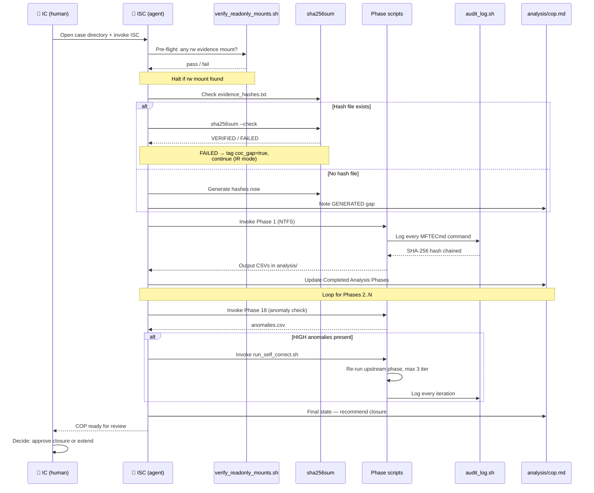
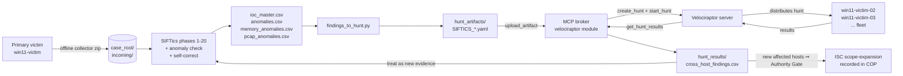
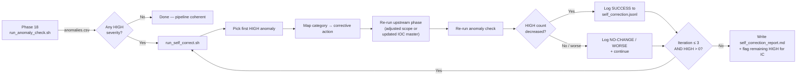
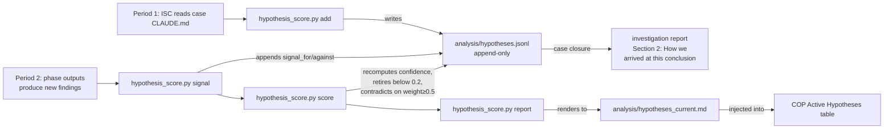

# SIFTics Architecture

This document is the visual map of how SIFTics components connect: who decides what,
which guardrails are architectural vs prompt-based, and how evidence flows from raw
collection to the final investigation report.

The hackathon's Architecture Diagram requirement asks where security boundaries are
enforced. Each guardrail in this diagram is annotated with its enforcement type:

- **🟢 Architectural** — enforced by code or the OS, independent of agent compliance
- **🟡 Prompt-based** — enforced by skill prose; depends on the agent following the rule
- **🔵 Audited** — actions are logged and tamper-evident; the agent can do them but
  every action is traceable

---

## Top-level architecture

```mermaid
flowchart TB
    subgraph IC["👤 INCIDENT COMMANDER (human analyst)"]
        IC1[Sets case scope and brief]
        IC2[Reviews COP between operational periods]
        IC3[Approves customer-facing report before delivery]
        IC4[Authorizes scope expansion to new evidence sources]
        IC5[Authorizes case closure]
    end

    subgraph CC["🤖 CLAUDE CODE — Agent Layer"]
        ISC["Investigation Section Chief skill<br/><i>Operational period loop, COP ownership,<br/>Authority Gates, Cross-Skill Pivot Protocol</i>"]
        TM["triage-methodology skill<br/><i>Phase sequencing, break/skip/re-run<br/>conditions, parallel execution gate</i>"]
        HE["hypothesis-engine skill<br/><i>Working-theory ledger, signal scoring,<br/>retire on confidence drop</i>"]
        DOMS["Domain skills<br/><i>memory-analysis, network-analysis,<br/>windows-artifacts, malware-analysis,<br/>yara-hunting, linux-host, edr-telemetry,<br/>cloud-forensics, macos-triage, daedalus,<br/>plaso-timeline, sleuthkit</i>"]
        IRR["investigation-report skill<br/><i>DRAFT report; IC approves before delivery</i>"]
        CVE["cve-attribution skill<br/><i>Phase 16 — Intel ICS handoff</i>"]
    end

    subgraph SCRIPTS["⚙️ TOOL LAYER — bash + python phase scripts"]
        S1["Phase 1–17 parsers<br/>(NTFS, Registry, EVTX, Artifacts,<br/>Execution, Hunting, CredAccess,<br/>AntiForensics, IOC, C2 Beacon,<br/>Browser, Ransomware, WebServer,<br/>Email, Linux, CVE, AttackPath)"]
        S2["Phase 18 — run_anomaly_check.sh<br/><i>Cross-artifact contradiction scanner</i>"]
        S3["Phase 19 — run_memory.sh<br/><i>Volatility 3 + YARA</i>"]
        S4["Phase 20 — run_pcap.sh<br/><i>tshark + Zeek + beacon scoring</i>"]
        SC["run_self_correct.sh<br/><i>Self-correction loop driver<br/>(max 3 iterations)</i>"]
        AL["audit_log.sh<br/><i>Hash-chained JSONL audit per command</i>"]
        SAN["sanitize_for_llm.py<br/><i>Prompt-injection regex sanitizer</i>"]
        VRO["verify_readonly_mounts.sh<br/><i>Pre-flight RO mount check</i>"]
        AV["audit_verify.sh<br/><i>SHA-256 chain verifier</i>"]
        TC["test_constraints.py<br/><i>Bypass test harness</i>"]
        HS["hypothesis_score.py<br/><i>JSONL ledger CLI</i>"]
    end

    subgraph EV["📦 EVIDENCE SOURCES (read-only)"]
        E1["KAPE collections<br/>($MFT, registry hives, EVTX, etc.)"]
        E2["Memory images<br/>(*.mem, *.raw, *.dmp, *.vmem)"]
        E3["Network captures<br/>(*.pcap, *.pcapng)"]
        E4["Email artifacts<br/>(*.pst, *.ost, *.mbox)"]
        E5["Linux ext4 partitions<br/>(via losetup)"]
        E6["Cloud logs<br/>(CloudTrail, GuardDuty)"]
    end

    subgraph OUT["📤 OUTPUT PIPELINE"]
        O1["analysis/cop.md<br/><i>Common Operating Picture</i>"]
        O2["analysis/forensic_audit.jsonl<br/><i>Hash-chained command log</i>"]
        O3["analysis/hypotheses.jsonl<br/><i>Working-theory ledger</i>"]
        O4["analysis/anomalies.csv<br/><i>Cross-artifact contradictions</i>"]
        O5["analysis/self_correction.jsonl<br/><i>Iteration-by-iteration trace</i>"]
        O6["analysis/attack_path.{csv,md,mermaid}<br/><i>Cross-machine lateral graph</i>"]
        O7["reports/investigation_report.md<br/><i>DRAFT — IC approval required</i>"]
        O8["reports/<case>_package.zip<br/><i>Customer HTML deliverable</i>"]
    end

    IC1 --> ISC
    ISC -->|invokes at Period 1| TM
    ISC -->|invokes per period| HE
    ISC -->|routes per evidence type| DOMS
    ISC -->|at closure| IRR
    ISC -->|when patterns identified| CVE

    TM -->|sequences| S1
    TM -->|sequences| S2
    TM -->|sequences| S3
    TM -->|sequences| S4

    S2 -->|HIGH anomalies trigger| SC
    SC -->|re-runs upstream| S1
    SC -->|re-runs upstream| S2

    S1 -.->|reads RO| E1
    S3 -.->|reads RO| E2
    S4 -.->|reads RO| E3
    S1 -.->|reads RO| E4
    S1 -.->|reads RO| E5
    DOMS -.->|reads RO| E6

    S1 -->|every command| AL
    S2 -->|every command| AL
    S3 -->|every command| AL
    S4 -->|every command| AL
    SC -->|every iteration| AL

    AL -->|append-only| O2
    HS -->|append-only| O3
    S2 --> O4
    SC --> O5
    S1 --> O6
    IRR --> O7
    IRR --> O8
    ISC -->|every period| O1

    HE -->|reads + writes| O3
    HS --- HE
    SAN -.->|sanitizes before LLM read| O7
    AV -.->|verifies| O2
    TC -.->|tests architecture| AL
    TC -.->|tests architecture| SAN
    TC -.->|tests architecture| VRO

    IC2 -.->|reads| O1
    IC3 -.->|reads| O7
    IC4 -.->|reads| O1
    IC5 -.->|reads| O1

    classDef arch fill:#1f5c2e,stroke:#0d3d1e,color:#fff
    classDef prompt fill:#7a5d00,stroke:#4d3a00,color:#fff
    classDef audited fill:#1a4d80,stroke:#0d2c4d,color:#fff
    class AL,AV,SAN,VRO,SC,S2,HS,TC arch
    class ISC,TM,HE,DOMS prompt
    class S1,S3,S4,IRR,CVE audited
```



---

## Guardrails by enforcement type

### 🟢 Architectural (do not depend on agent compliance)

| Guardrail | Enforced by | Bypass test |
|---|---|---|
| Hash-chained audit log of every command | `audit_log.sh` sourced by all 18 phase scripts; SHA-256 chain over canonical JSON | T4 in `test_constraints.py` (verified: tamper detected, exit ≠ 0) |
| Tamper detection on the audit log | `audit_verify.sh` recomputes hashes line-by-line | T4 (verified) |
| Read-only mount preflight check | `verify_readonly_mounts.sh` parses `/proc/mounts`, halts on any rw evidence mount | T5 (verified — script callable) |
| Intake hash mismatch detection | `sha256sum --check` on `evidence_hashes.txt` | T6 (verified — tamper detected, ISC tags `coc_gap=true` and continues per IR mode) |
| Prompt-injection sanitization | `sanitize_for_llm.py` — 22 regex patterns, paired sanitized/unsanitized outputs | T3 (verified: 4/4 detected, 0 false positives on control row) |
| Self-correction iteration cap | `run_self_correct.sh` hard-coded `MAX_ITERATIONS=3` | Inspectable in code |
| Cross-artifact anomaly detection | `run_anomaly_check.sh` — 10 contradiction categories | Runs deterministically against existing CSVs |
| Settings.json `permissions.deny` | Claude Code harness blocks `rm -rf`, `dd`, `wget`, `curl`, `ssh`, `WebFetch` at tool-invocation time | T2 (verified — config inspection) |
| Output path scoping | All scripts write only to `${CASE_ROOT}/analysis/`, `/exports/`, `/reports/` | Inspectable in script source; T1 documents the prompt-based outer boundary |

### 🟡 Prompt-based (depend on agent following the rule)

| Guardrail | Enforced by | Failure mode |
|---|---|---|
| Never write to evidence directories (`/cases/`, `/mnt/`, `/media/`) | CLAUDE.md global instruction + ISC skill Hard Rules | If the agent ignores the rule, the OS allows the write. Mitigations: read-only mounts (architectural), MCP server with no write functions (deferred). |
| Always classify findings as CONFIRMED / INFERRED / CONTRADICTED | ISC skill Finding Taxonomy | Unclassified findings would skip the analytic-confidence layer in the report; partially mitigated by report skill validating the COP table format |
| Apply Knowledge Gap Framework before invoking any skill | ISC skill Operational Period Structure | Skipping leads to running everything in parallel and missing answers that were available; observable in `forensic_audit.jsonl` |
| Sanitize attacker-controlled CSVs before reading | ISC skill Prompt Injection Defense | Documented — analyst can verify by checking COP "Completed Analysis Phases" for sanitization entries |
| At least one active hypothesis ≥0.5 confidence per period | hypothesis-engine skill | `hypothesis_score.py score` prints WARNING if not — observable in CI/script output |

### 🔵 Audited (action allowed but recorded; the audit chain is architectural)

Every tool execution in the 18 phase scripts produces a JSONL entry with timestamp,
machine, tool, full command, purpose, output path, result, exit code, and SHA-256 hash
chained to the previous entry. The chain is verifiable with `audit_verify.sh`. This
turns "did the agent do something it shouldn't" from an unknowable into a forensically
investigable question.

---

## Evidence integrity flow



---

## Detect → Hunt loop (SIFTics + Velociraptor via MCP broker)

The SIFTics findings on a primary victim get converted to Velociraptor hunt
artifacts and pushed across the fleet — autonomous lateral hunting, with
results ingested back into the case for cross-host correlation. The agent
sees the broker only through the typed-function MCP catalog; it cannot exec
arbitrary commands on the Velociraptor server.



Architectural enforcement:

- The agent calls a fixed catalog of 10 typed functions (see
  `mcp_broker/README.md`). It cannot send arbitrary VQL or exec shell
  commands on the Velociraptor server.
- All agent-supplied strings flow through `_safe_str()` which rejects
  VQL-reserved characters before subprocess invocation.
- Custom artifact names must start with `SIFTICS_` or `Custom.` —
  `upload_artifact` rejects names that would overwrite Velociraptor built-ins.
- Velociraptor API client cert/key never enter the agent's context window;
  loaded server-side only.
- Every MCP call is logged to `mcp_broker/audit.jsonl` with timestamp, args
  digest (sensitive values redacted), result summary, latency, and status.

`scripts/run_detect_hunt_loop.sh` orchestrates the full sequence with a hard
cap on iterations to prevent runaway. Mock mode (`SIFTICS_MCP_MOCK=1`) lets
the loop run without a real Velociraptor server for development and demos.

---

## Self-correction loop architecture



The hard 3-iteration cap and the per-iteration logging make this loop deterministic
and bounded — no risk of runaway. Every action is recorded with timestamp, exit code,
and HIGH-anomaly delta, so the demo video can show the exact state transitions.

---

## Hypothesis engine ledger flow



Confidence is computed mechanically by the script, not estimated by the LLM. The LLM
provides the signals (text descriptions tied to COP findings); the script does the math.
This separation prevents LLM drift in confidence assessment.

---

## File-system layout

```
SIFTics/
├── CLAUDE.md                          ← operator's global instructions
├── README.md                          ← installation + Try-It-Out + workflow
├── CHANGES.md                         ← change log
├── docs/architecture.md               ← THIS FILE
├── benchmark/ground_truth/            ← public CTF ground-truth manifests
├── config/                            ← ioc_denylist.json, dcsync_allowlist.txt
├── reports/bypass_test_report.md      ← Constraint Implementation evidence
├── scripts/
│   ├── audit_log.sh                   ← hash-chained JSONL audit (architectural)
│   ├── audit_verify.sh                ← chain verifier (architectural)
│   ├── audit_query.sh                 ← search the audit log
│   ├── verify_readonly_mounts.sh      ← RO preflight (architectural)
│   ├── sanitize_for_llm.py            ← prompt-injection sanitizer (architectural)
│   ├── test_constraints.py            ← bypass test harness
│   ├── hypothesis_score.py            ← hypothesis ledger CLI
│   ├── score_benchmark.py             ← accuracy benchmark scorer
│   ├── run_ntfs.sh                    ← Phase 1
│   ├── run_registry.sh                ← Phase 2
│   ├── ... (Phases 3–17)
│   ├── run_anomaly_check.sh           ← Phase 18 (NEW: contradiction scanner)
│   ├── run_memory.sh                  ← Phase 19 (NEW: Volatility 3 autonomous)
│   ├── run_pcap.sh                    ← Phase 20 (NEW: tshark + Zeek)
│   └── run_self_correct.sh            ← NEW: self-correction loop driver
├── skills/
│   ├── investigation-section-chief/   ← agent's NIMS ICS role
│   ├── triage-methodology/            ← phase sequencing + break conditions
│   ├── hypothesis-engine/             ← NEW: working-theory ledger
│   ├── daedalus/                      ← adaptive artifact discovery
│   ├── investigation-report/          ← DRAFT report generator
│   ├── cve-attribution/               ← Intel ICS Phase 16
│   └── (10 domain skills)
└── templates/case_claude.md           ← per-case CLAUDE.md template
```
